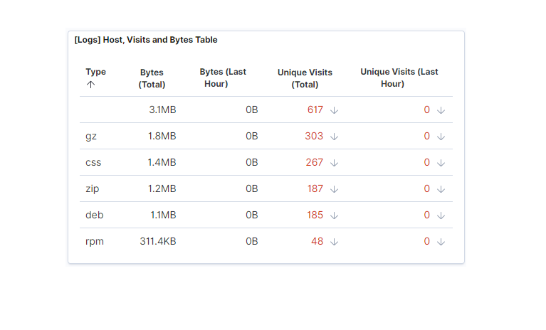
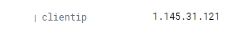

Activity File: Exploring Kibana

You are a DevOps professional and have set up monitoring for one of your web servers. You are collecting all sorts of web log data and it is your job to review the data regularly to make sure everything is running smoothly. 

Today, you notice something strange in the logs and you want to take a closer look.

Your task: Explore the web server logs to see if there's anything unusual. Specifically, you will:

:warning: **Heads Up**: These sample logs are specific to the time you view them. As such, your answers will be different from the answers provided in the solution file. 

---

Instructions

1. Add the sample web log data to Kibana.

Kibana Home Page.

Click on Load a data set and a Kibana dashboard under add sample data on the Kibana home page.

Click on view data in the Sample web logs.

Click Dashboard.

Display Kibana Dashboard.

2. Answer the following questions:

    - In the last 7 days, how many unique visitors were located in India? 200.

    - In the last 24 hours, of the visitors from China, how many were using Mac OSX? 8

    - In the last 2 days, what percentage of visitors received 404 errors? How about 503 errors?
       error 404 error 6.7+0=6.7%; error 503 6.7+8.3= 15.0%. (Averaging between points on the graph).

    - In the last 7 days, what country produced the majority of the traffic on the website? China,

    - Of the traffic that's coming from that country, what time of day had the highest amount of activity? 13.00 P.M

    - List all the types of downloaded files that have been identified for the last 7 days, along with a short description of each       file type (use Google if you aren't sure about a particular file type).
gz--an archive file compressed by the gzip compression algorithm.
css--programming language used to design the webpage for better layouts.
zip--file compression 
deb--extension of the software package format for the Debian Linux distribution as Ubuntu.
rpm--installation package originally developed for the Red Hat Linux operating system.

3. Now that you have a feel for the data, Let's dive a bit deeper. Look at the chart that shows Unique Visitors Vs. Average Bytes.
     - Locate the time frame in the last 7 days with the most amount of bytes (activity).
       Avg bytes 14438; Count 1.

       
     - In your own words, is there anything that seems potentially strange about this activity?
       Number of visitors low compare to average bytes.

4. Filter the data by this event.
     - What is the timestamp for this event?
       Dec 16, 2021 @ 16:58:16.297

     - What kind of file was downloaded?
       gz file downloaded 

     - From what country did this activity originate? CN-China

     - What HTTP response codes were encountered by this visitor? HTTP 200

  

 

5. Switch to the Kibana Discover page to see more details about this activity.
     - What is the source IP address of this activity?
       Source ip 	1.145.31.121

 
     
     - What are the geo coordinates of this activity?
       geo.coordinates	
       "lat": 28.28980556
       "lon": -81.43708333

 

     - What OS was the source machine running? Win 8

        

     - What is the full URL that was accessed?
       https://artifacts.elastic.co/downloads/kibana/kibana-6.3.2-linux-x86_64.tar.gz
 

     - From what website did the visitor's traffic originate?
       http://www.elastic-elastic-elastic.com/success/aleksandr-serebro
 

6. Finish your investigation with a short overview of your insights. 

     - What do you think the user was doing?
       Downloading Kibana for Linux as a .tar.gz package
     
     - Was the file they downloaded malicious? If not, what is the file used for?
       The file was not downloaded maliciously. Used to install Kabana.

     - Is there anything that seems suspicious about this activity? None.

     - Is any of the traffic you inspected potentially outside of compliance guidelines?
       Traffic seems to fall within the compliance guidelines.

---
© 2020 Trilogy Education Services, a 2U, Inc. brand. All Rights Reserved.  