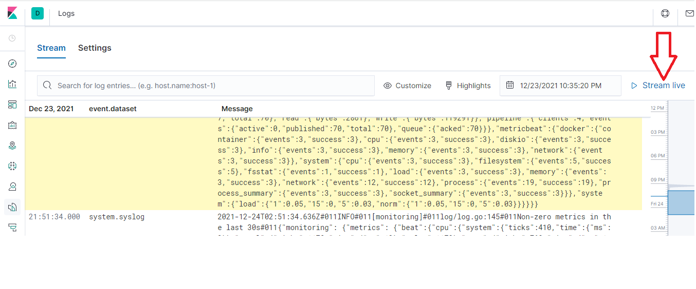
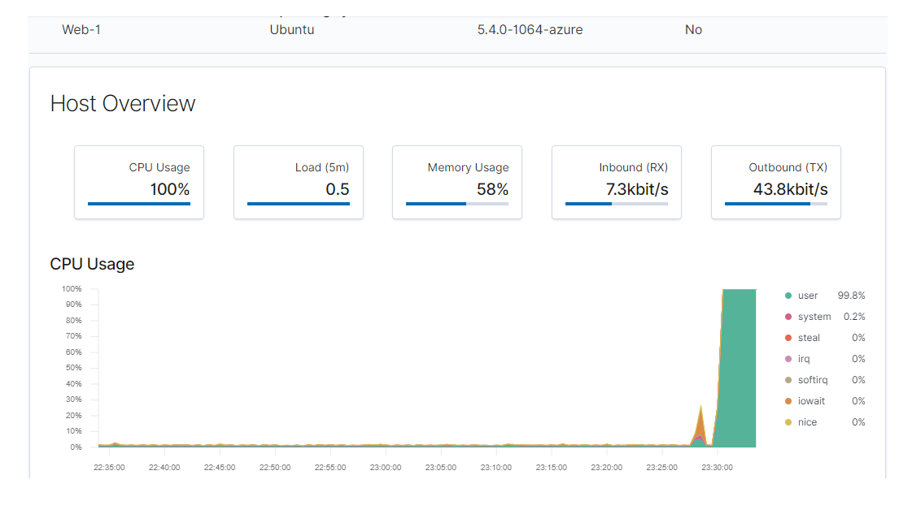
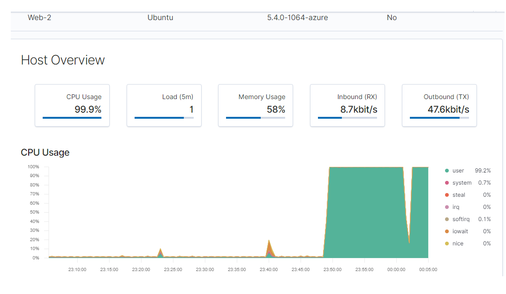
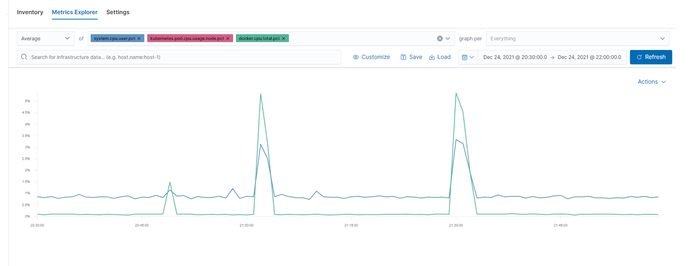

Activity File: Kibana Continued

- This week, you created the infrastructure behind a security information and event management system such as Kibana. Once that set up is complete, you will have finished the project. 

- This optional activity tasks you with exploring more Kibana capabilities, some of which you will use in future projects.  

- Note: In order to complete these activities, you will need to complete the optional Metricbeat configuration.


Scenario 

In this activity, you will suppose the role of a cloud architect that has been tasked with setting up an ELK server to gather logs for the Incident Response team.

Before you hand over the server to the IR team, your senior architect has asked that you verify the ELK server is working as expected and pulling both logs and metrics from the pen-testing web servers.

You will have three tasks: 

1. Generate a high amount of failed SSH login attempts and verify that Kibana is picking up this activity.

2. Generate a high amount of CPU usage on the pen-testing machines and verify that Kibana picks up this data.

3. Generate a high amount of web requests to your pen-testing servers and make sure that Kibana is picking them up.


These activities will guide you though generating some data to visualize in Kibana. Each of these activity will require the following high level steps: 

1. Use your jump-box to attack your web machines in various ways.
2. Use a Linux utility to stress the system of a webVM directly. 
3. Subsequently generate traffic and logs that Kibana will collect.
4. View that traffic in various ways inside Kibanna.


It's also worth noting that these activities comprise different job roles:

- Getting the infrastructure setup and maintaining it is the role of a security engineer or cloud architect. 

- Using that infrastructure by creating dashboards and alerts fall under the security analyst role. It would be rare to have a position where you would be required to do both.

That said, now that we have Kibana setup and gathering data from three web servers, its worth learning how to visualize data in Kibana.

Before getting started, we'll have to complete some metrics and logs set up. 

Setup: Kibana Metrics and Logs Orientation

Before we begin generating traffic, locate the two screens inside Kibana that you will use to visualize this traffic:

- Logs
- Metrics


These pages will show you the changes in data that we will create.

Logs

- Click Logs to see some general system logs coming from the web machines.


- Notice that you can stream logs live from the machines. 



Metrics

- Next, click Metrics on the left side. 

    - Here we can see each of our VMs that are sending metrics.

- Click on one of the large squares that represent one of your VMs.

- Choose View metrics from the dropdown that appears.


- Notice that you can see CPU and memory usage here.


Now that we know where to look for this data, let's generate some unusual network traffic.

Activity Tasks

Expand the provided activity files to complete each task. These tasks can be completed in any order. 

SSH Barrage

Task: Generate a high amount of failed SSH login attempts and verify that Kibana is picking up this activity.

Activity File: SSH Barrage

Scenario

- You are a cloud architect that has been tasked with setting up an ELK server to gather logs for the Incident Response team to use for training.

- Before you hand over the server to the IR team, your senior architect has asked you to verify the ELK server is working as expected and pulling both logs and metrics from the pentesting web servers.

Your Task: Generate a high amount of failed SSH login attempts and verify that Kibana is picking up this activity.

---

Instructions

One way we can generate logs of interest is to create some failed SSH logins on our servers.

- The only environment that holds our SSH keys is our Ansible container. Attempting to create an SSH connection from any other environment will trigger a log entry.

- We can also create a log entry by attempting to log in with the wrong username.

- Note: A successful SSH login also creates a log entry, but here we will focus on failed logins.

We can easily do this by trying to SSH to a web machine from our jump box directly without using the Ansible container. 

1. Start by logging into your jump-box. 

	- Run: `ssh username@ip.of.web.vm`

	- You should receive an error:

		```bash
		sysadmin@Jump-Box-Provisioner:~$ ssh sysadmin@10.0.0.5
		sysadmin@10.0.0.5: Permission denied (publickey).
		```

	- This error was also logged and sent to Kibana. 

2.  Run the failed SSH command in a loop to generate failed login log entries.

	 - You can use a bash `for` or `while` loop, directly on the command line, to repeatedly run the SSH command.
            sysadmin@JumpBoxProvisioner:~$ while true; do ssh sysadmin@10.0.0.6; done

3. Search through the logs in Kibana to locate your generated failed login attempts.


Bonus: Create a nested loop that generates SSH login attempts across all three of your VM's.
       while true; do ssh sysadmin@10.0.0.6 10.0.0.7; done

Linux Stress

Task: Generate a high amount of CPU usage on the pentesting machines and verify that Kibana picks up this data.


Activity File: Linux Stress 


Scenario

- You are a cloud architect that has been tasked with setting up an ELK server to gather logs for the Incident Response team to use for training.

- Before you hand over the server to the IR team, your senior architect has asked that you verify the ELK server is working as expected and pulling both logs and metrics from the pen-testing web servers.


**Your Task**: Generate a high amount of CPU usage on the pentesting machines and verify that Kibana picks up this data.

---

#### Notes

The Metrics page for a single VM shows the CPU usage for that machine. This shows how much work the machine is doing. Excessively high CPU usage is typically a cause for concern, as overworked computers are at greater risk for failure.

- Metricbeat forwards data about CPU load to Elasticsearch, which can be visualized with Kibana.

- In this activity, you will intentionally stress the CPU of one of your VMs, then find evidence of the increased activity in Kibana.

Linux has a common, easy-to-use diagnostic program called `stress`. It is easy to use and can be downloaded via `apt`.

Instructions

1. From your jump box, start up your Ansible container and attach to it.

2. SSH from your Ansible container to one of your WebVM's.

3. Run `sudo apt install stress` to install the stress program.

4. Run `sudo stress --cpu 1` and allow `stress` to run for a few minutes. 

5. View the Metrics page for that VM in Kibana.  What indicates that CPU usage increased?

6. Run the `stress` program on all three (mine 2 VMs) of your VMs and take screenshots of the data generated on the Metrics page of Kibana.
 
                

  	- Note:The stress program will run until you quit with Ctrl+C.


wget-DoS


Task: Generate a high amount of web requests to your pen-testing servers and make sure that Kibana is picking them up.


Activity File: wget-DoS


Scenario

- You are a cloud architect that has been tasked with setting up an ELK server to gather logs for the Incident Response team to use for training.

- Before you hand over the server to the IR team, your senior architect has asked that you verify the ELK server is working as expected and pulling both logs and metrics from the pen-testing web servers.

**Your Task**: Generate a high amount of web requests to your pen-testing servers and make sure that Kibana is picking them up.

---

#### Instructions

The Metrics section for a single VM will show Load and Network Traffic data. 

We can generate abnormal data to view by creating a DoS web attack. The command-line program `wget` can do this easily.

`wget` will download a file from any web server. Use man pages for more info on `wget`.

1. Log into your jump box.

2. Run `wget ip.of.web.vm`.

	```bash
	sysadmin@Jump-Box-Provisioner:~$ wget 10.0.0.5
	--2020-05-08 15:44:00--  http://10.0.0.5/
	Connecting to 10.0.0.5:80... connected.
	HTTP request sent, awaiting response... 302 Found
	Location: login.php [following]
	--2020-05-08 15:44:00--  http://10.0.0.5/login.php
	Reusing existing connection to 10.0.0.5:80.
	HTTP request sent, awaiting response... 200 OK
	Length: 1523 (1.5K) [text/html]
	Saving to: ‘index.html’

	index.html            100%[=======================>]   1.49K  --.-KB/s    in 0s      

	2020-05-08 15:44:00 (179 MB/s) - ‘index.html’ saved [1523/1523]
	```

3. Run `ls` to view the file you downloaded from your web VM to your jump box. 

	```bash
	sysadmin@Jump-Box-Provisioner:~$ ls
	index.html
	```

4. Run the `wget` command in a loop to generate many web requests.

	- You can use a bash `for` or `while` loop, directly on the command line, just as you did with the SSH command.
          azdmin@JumpBoxProvisioner:~$ while true; do wget 10.0.0.6; done

5. Open the Metrics page for the web machine you attacked and answer the following questions:
	
	- Which of the VM metrics were affected the most from this traffic? Load and Network.



Bonus: Notice that your `wget` loop creates a lot of duplicate files on your jump box.

-  Write a command to delete _all_ of these files at once.

   azdmin@JumpBoxProvisioner:~$ ls

   index.html  index.html.1  index.html.2  index.html.3  index.html.4  index.html.5  index.html.6  index.html.7

   azdmin@JumpBoxProvisioner:~$ rm *

   azdmin@JumpBoxProvisioner:~$ ls

   azdmin@JumpBoxProvisioner:~$

-  Find a way to run the `wget` command without generating these extra files.
		
	- Look up the flag options for `wget` and find the flag that lets you choose a location to save the file it downloads. 

          wget -P or--directory-prefix 
		
	- Save that file to the Linux directory known as the "void" or the directory that doesn't save anything.

          wget -P 10.0.0.6 > /dev/null 

Bonus: Write a nested loop that sends your `wget` command to all three (mine 2 VMs) of your web VMs over and over.
           azdmin@JumpBoxProvisioner:~$ while true; do wget sysadmin@10.0.0.6 10.0.0.7; done


---

© 2020 Trilogy Education Services, a 2U, Inc. brand. All Rights Reserved.  
