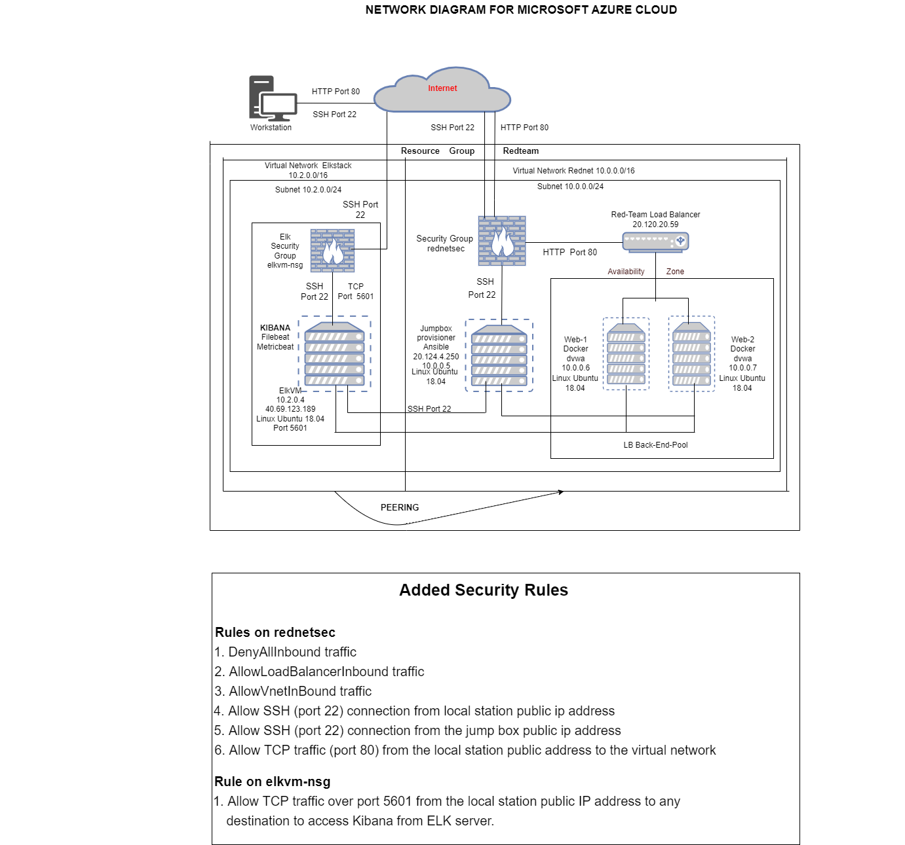
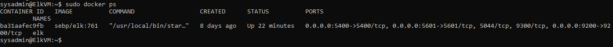
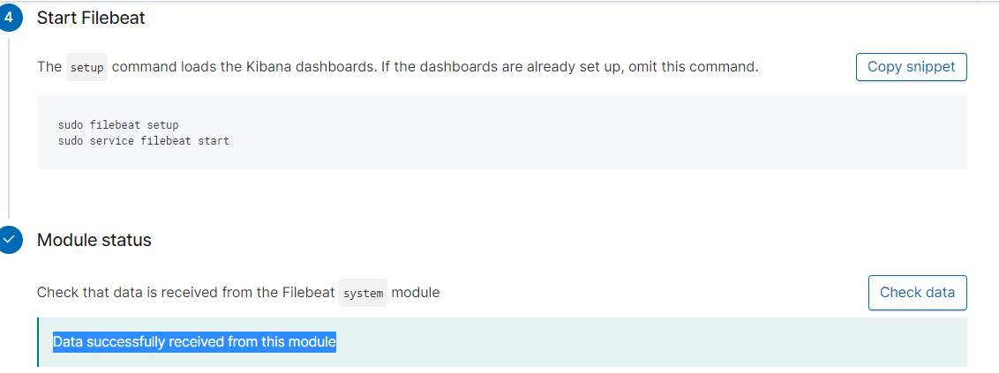
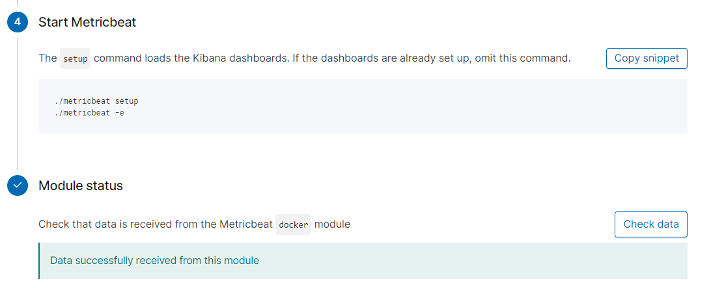

## Automated ELK Stack Deployment

The files in this repository were used to configure the network depicted below.

These files have been tested and used to generate a live ELK deployment on Azure. They can be used to either recreate the entire deployment pictured above. Alternatively, select portions of the _configuration_ file may be used to install only certain pieces of it, such as Filebeat.

Enter the playbook file. elk-playbook.yml

This document contains the following details:
- Description of the Topology
- Access Policies
- ELK Configuration
  - Beats in Use
  - Machines Being Monitored
- How to Use the Ansible Build

### Description of the Topology

The main purpose of this network is to expose a load-balanced and monitored instance of DVWA, the D*mn Vulnerable Web Application.

Load balancing ensures that the application will be highly available, in addition to restricting access to the network.
- What aspect of security do load balancers protect? What is the advantage of a jump box?
  Load balancers protect the servers from a denial of service attack. distribute the load. The advantage of a jump box is that it protects the virtual machines from being exposed from the public internet.

Integrating an ELK server allows users to easily monitor the vulnerable VMs for changes to the _data_and system _logs.
- What does Filebeat watch for?_Collects log files from very specific files and forwards them either to Elasticsearch or Logstash.
- What does Metricbeat record?_Collects machine metrics such as uptime and send the output to Elasticsearch or Logstash.

The configuration details of each machine may be found below.
_Note: Use the [Markdown Table Generator](http://www.tablesgenerator.com/markdown_tables) to add/remove values from the table_.

| Name          | Function                  | IP Address   | Operating System   |
|---------------|---------------------------|--------------|--------------------|
| Jump Box      | Jump Box                  | 10.0.0.5     | Linux ubuntu 18.04 |
| Web-1         | VM Server                 | 10.0.0.6     | Linux ubuntu 18.04 |
| Web-2         | VM Server                 | 10.0.0.7     | Linux ubuntu 18.04 |
| Elk VM        | Log Analysis              | 10.2.0.4     | Linux ubuntu 18.04 |
| Load Balancer | Secure/Distribute traffic | 20.120.20.59 | Linux ubuntu 18.04 |
| Workstation   | Access Control            | Public IP    | Windows 10         |

### Access Policies

The machines on the internal network are not exposed to the public Internet. 

Only the _Jump Box Provisioner__ machine can accept connections from the Internet. Access to this machine is only allowed from the following IP addresses: Workstation Public IP through port 22.
-Add whitelisted IP addresses_ : This is the public IP of the local workstation which is outside the network.

Machines within the network can only be accessed by Workstation and Jump-Box-Provisioner.
- Which machine did you allow to access your ELK VM? What was its IP address?_Jump-Box-Provisioner IP : 10.0.0.4 via SSH port 22 and 
  Workstation Public IP via port TCP 5601
 
A summary of the access policies in place can be found in the table below.

| Name          | Publicly Accessible | Allowed IP Addresses                 |
|---------------|:-------------------:|--------------------------------------|
| Jump Box      |          No         | Workstation Public IP SSH on Port 22 |
| Web-1         |          No         | 10.0.0.6 SSH on Port 22              |
| Web-2         |          No         | 10.0.0.7 SSH on Port 22              |
| ELK VM        |          No         | Workstation Public IP on TCP 5601    |
| Load balancer |          Yes        | Workstation Public IP on HTTP 80     |

### Elk Configuration

Ansible was used to automate configuration of the ELK machine. No configuration was performed manually, which is advantageous because it is very simple to set up and use. 
- What is the main advantage of automating configuration with Ansible? Configuration can be done on multiple machines at the same 
  time instead of one at a time.

The playbook implements the following tasks:
- In 3-5 bullets, explain the steps of the ELK installation play. E.g., install Docker; download image; etc._
1. Download deb docker.io pkgl--use apt to install docker.io
2. Download python3-pip package--use apt to install  python3-pip package
3. Download docker pip module--use pip to install the docker module
4. Download and launch a docker elk container--docker pip module to install elk image
5. Run/enable service docker on boot
- ...

The following screenshot displays the result of running `docker ps` after successfully configuring the ELK instance.

### Target Machines & Beats
This ELK server is configured to monitor the following machines:
- Web-1 : 10.0.0.6
  Web-2 : 10.0.0.7

We have installed the following Beats on these machines:
- Filebeat
  Metricbeat
These Beats allow us to collect the following information from each machine:
- In 1-2 sentences, explain what kind of data each beat collects, and provide 1 example of what you expect to see. E.g., `Winlogbeat` collects Windows logs, which we use to track user logon events, etc._

Filebeat : Filebeat will be used to collect log files from very specific files. Syslog hostnames and processes; webservers. 
Metricbeat : Metricbeat collects machine metrics such as uptime. Use to monitor system-level CPU usage, memory, file system, disk IO, and network IO statistics.

### Using the Playbook
In order to use the playbook, you will need to have an Ansible control node already configured. Assuming you have such a control node provisioned: 

SSH into the control node and follow the steps below:
- Update the filebeat-config.yml file to include the private IP address of your ELK machine in lines #1106 and 1806.
- Copy the filebeat-config.yml/metricbeat-config.yml file to files from ansible to the webservers.
- 
output.elasticsearch:
   hosts: ["10.2.0.4:9200"]
  username: "elastic"
  password: "changeme"

setup.kibana:
  host: "10.2.0.4:5601"

- Run the playbook "ansible-playbook filebeat-playbook.yml", and navigate to http://public ip elk server:5601/app/kibana--log-add log data-system log-last module Module status--click check data to check that the installation worked as expected.

- Update the metricbeat-config.yml file to include the private IP address of your ELK machine.
- Copy the metricbeat-config.yml file to files from ansible to the webservers.

setup.kibana:
  host: "10.2.0.4:5601"

output.elasticsearch:
  Array of hosts to connect to.
  hosts: ["10.2.0.4:9200"]
  username: "elastic"
  password: "changeme"

- Run the playbook "ansible-playbook metricbeat-playbook.yml", and navigate to http://public ip elk server:5601/app/kibana--metrics-add metric-docker metrics-last module Module status--click check data to check that the installation worked as expected.

 Answer the following questions to fill in the blanks:_
- _Which file is the playbook? filebeat-playbook.yml/metricbeat-playbook.yml
   Where do you copy it?_/etc/ansible/files
- _Which file do you update to make Ansible run the playbook on a specific machine? Hosts file.
   How do I specify which machine to install the ELK server on versus which to install Filebeat on? In the hosts file. Create groups    in the hosts file and soecify which group to run in hosts file.
- _Which URL do you navigate to in order to check that the ELK server is running? http://public ip elk server:5601/app/kibana

_As a **Bonus**, provide the specific commands the user will need to run to download the playbook, update the files, etc._

Using the configuration file template for filebeat and metricbeat to download the playbook ; update the files.

-------Filebeat---------

 nano filebeat-playbook.yml

---
 - name: installing and launching filebeat
	   hosts: webservers
       become: true
       tasks:

	   - name: download filebeat deb
  	     command: curl -L -O https://artifacts.elastic.co/downloads/beats/filebeat/filebeat-7.7.1-amd64.deb

	   - name: install filebeat deb
  	     command: dpkg -i filebeat-7.7.1-amd64.deb

	   - name: drop in filebeat.yml
  	     copy:
   	       src: ./files/filebeat-configuration.yml
   	       dest: /etc/filebeat/filebeat.yml

	   - name: enable and configure system module
  	     command: filebeat modules enable system

	   - name: setup filebeat
  	     command: filebeat setup

	   - name: start filebeat service
  	    command: service filebeat start
---
   To run the filebeat playbook from the command line in the ansible directory : ansible-playbook /etc/ansible/files/filebeat-playbook.yml

-------Metricbeat-------                      

 nano metricbeat-playbook.yml

---
 - name: installing and launching metricbeat
	   hosts: webservers
       become: true
       tasks:

	   - name: download metricbeat deb
  	     command: curl -L -O https://artifacts.elastic.co/downloads/beats/metricbeat/metricbeat-7.7.1-amd64.deb

	   - name: install metricbeat deb
  	     command: dpkg -i metricbeat-7.7.1-amd64.deb

	   - name: drop in metricbeat.yml
  	     copy:
   	       src: ./files/metricbeat-configuration.yml
   	       dest: /etc/metricbeat/filebeat.yml

	   - name: enable and configure system module
  	     command: metricbeat modules enable system

	   - name: setup metricbeat
  	     command: metricbeat setup

	   - name: start metricbeat service
  	    command: service metricbeat start
---
   To run the metricbeat playbook from the command line in the ansible directory : ansible-playbook /etc/ansible/files/metricbeat-playbook.yml
